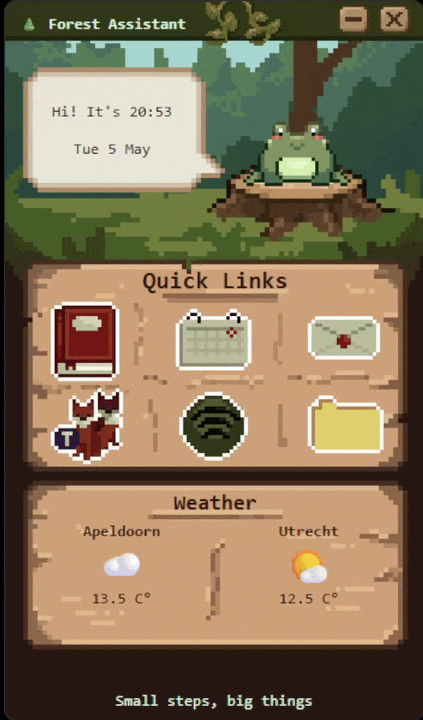

# 🌲 Forest Assistant

A cozy pixel art desktop assistant built with Electron.

## Features

- A cute frog that jumps when you click on it
- Live clock + date
- Quick links to frequently used apps
- Weather display (Apeldoorn & Utrecht)
- Fully custom pixel art assets that I made in Aseprite

## Preview

## Built with

- Electron
- HTLM / CSS / JavaScript
- Some styling done with Tailwind

## Future ideas

- Customizable themes/animals
- Discord Rich Presence
- More widgets (Commute / tasks)
- Ambient sounds corresponding with weather
